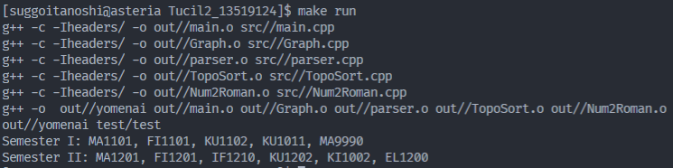
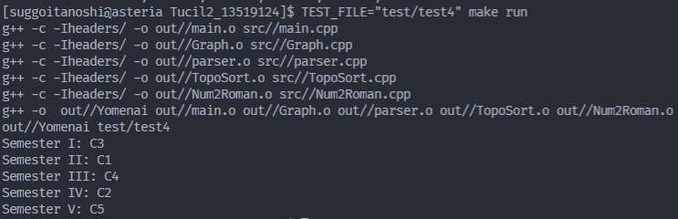

# Yomenai
(lit. Tidak dapat membaca)

## Apa ini?
Topological Sorting dengan strategi Decrease and Conquer.
Faktor pengurangannya adalah jumlah node yang derajat masuknya 0 saat iterasi 
tertentu, sehingga dapat berubah-ubah.

## Permasalahannya bagaimana?
Sederhananya, mata kuliah dimodelkan sebagai Directed Acylic Graph (DAG),
dengan sisi menggambarkan "prasyarat" mata kuliah tertentu. suatu kuliah yang
memiliki prasyarat akan memiliki sisi yang masuk dari mata kuliah yang
merupakan prasyaratnya.

## Cara menjalankan
TL;DR: `make run`.

Contoh berkas untuk menguji `main` dapat dilihat pada folder `test`.
Jika ingin mencoba, gunakan `make run` yang menyebabkan program berjalan dengan
masukan berkas uji `test`. Jika ingin mencoba dengan berkas yang lain, gunakan
environment variable `TEST_FILE`, misal `TEST_FILE="test/test4" make run`.

## Screenshot

